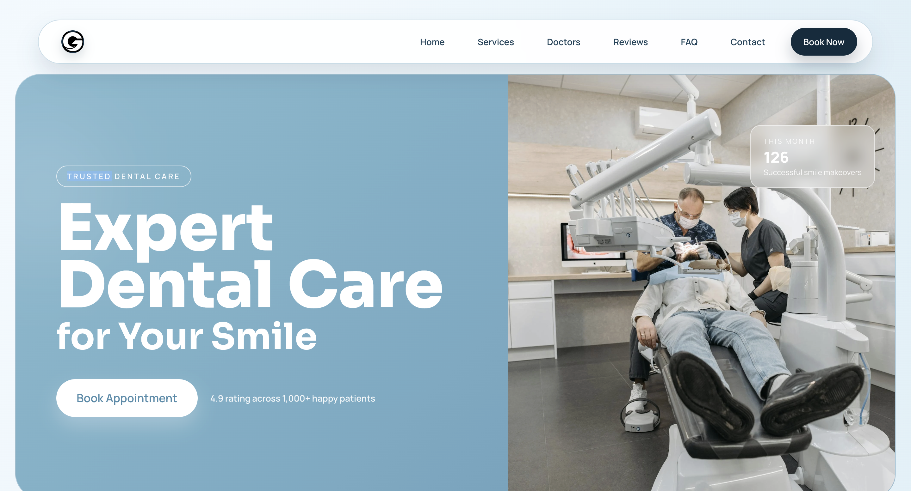
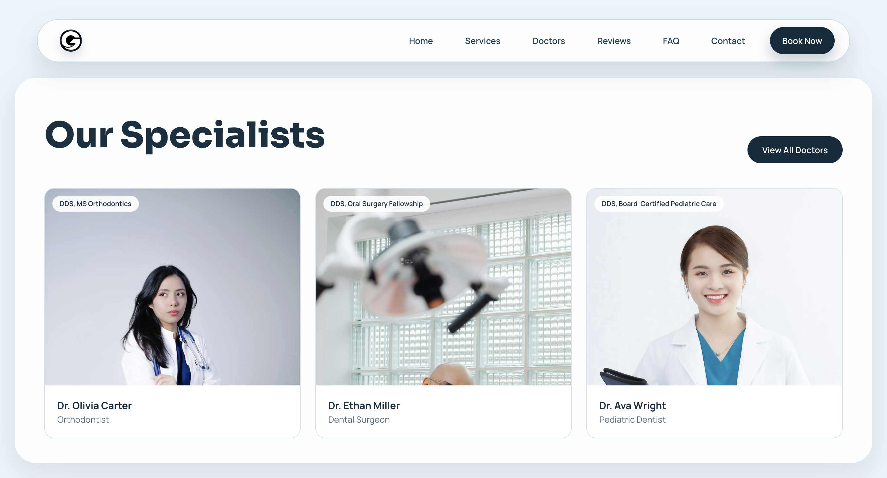
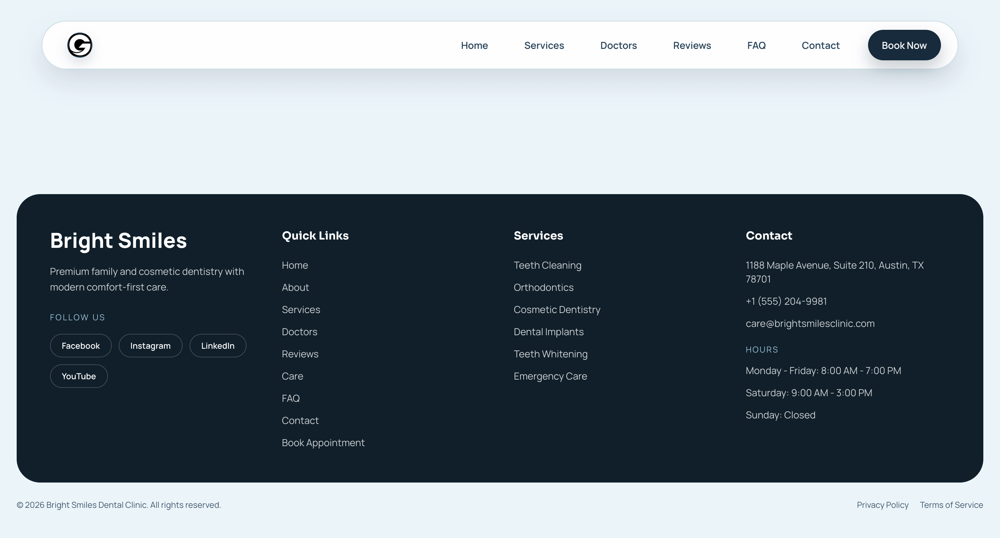
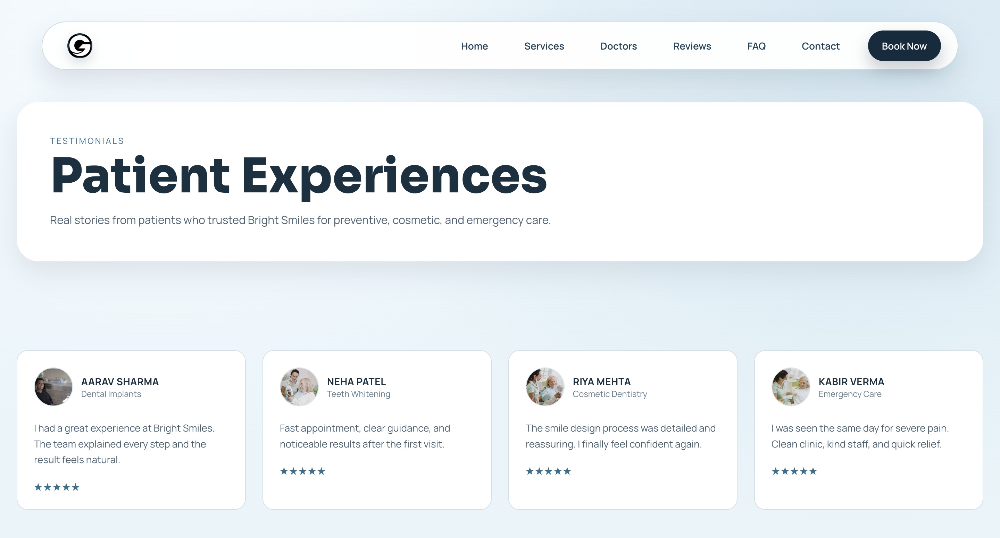
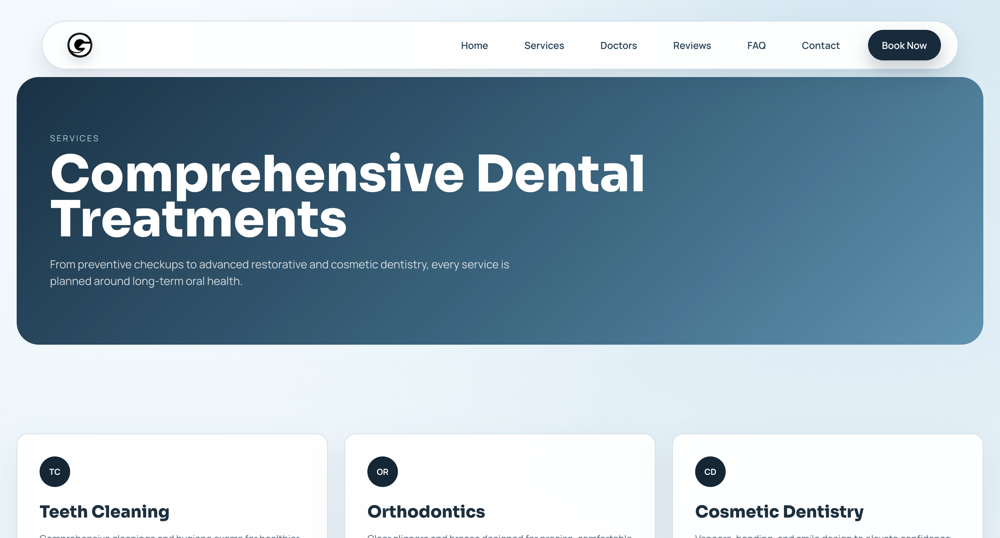

# Bright Smiles Dental Clinic







A polished dental clinic website built with Next.js, React, TypeScript, and Tailwind CSS. The project focuses on a premium marketing experience for a fictional clinic, with service discovery, doctor profiles, FAQs, testimonials, appointment flow, and SEO-ready metadata.

## Overview

Bright Smiles Dental Clinic is a multi-page static site designed for modern dental practices. It combines a clean healthcare-focused visual system with responsive layouts, lightweight motion, and reusable content-driven sections.

## Key Features

- Responsive homepage and inner pages for services, doctors, care, testimonials, FAQ, contact, and booking.
- SEO setup with page metadata, canonical URLs, `robots.txt`, `sitemap.xml`, and JSON-LD structured data.
- Reusable site content stored in a central data module for easier updates.
- GSAP-based motion for hero and section reveal interactions.
- Tailwind CSS styling with custom global layout utilities.
- Static generation through the Next.js App Router.

## Tech Stack

- Next.js 16
- React 19
- TypeScript
- Tailwind CSS
- GSAP

## Project Structure

```text
app/
  components/      Shared UI, SEO helpers, and site content
  about/           About page
  book-appointment/ Appointment booking page
  care/            Care products and guidance
  contact/         Contact page
  doctors/         Doctor listing page
  faq/             FAQ page
  services/        Services page
  testimonials/    Reviews and patient stories
public/            Static assets and screenshots
```

## Getting Started

### Prerequisites

- Node.js 18 or newer
- npm

### Install

```bash
npm install
```

### Run Locally

```bash
npm run dev
```

Open [http://localhost:3000](http://localhost:3000).

### Production Build

```bash
npm run build
npm run start
```

## Available Scripts

- `npm run dev` starts the local development server.
- `npm run build` creates the production build.
- `npm run start` runs the production server.
- `npm run lint` runs ESLint.

## Pages

- `/`
- `/about`
- `/services`
- `/doctors`
- `/care`
- `/testimonials`
- `/faq`
- `/contact`
- `/book-appointment`
- `/privacy`
- `/terms`

## SEO Notes

The project includes:

- page-level metadata helpers
- canonical URLs
- Open Graph and Twitter metadata
- `robots.txt`
- `sitemap.xml`
- clinic structured data in JSON-LD format

## Current Notes

- `npm run build` is passing.
- `npm run lint` currently has an ESLint plugin/rule compatibility issue in the existing setup.

## License

This project is private and intended for internal or portfolio use.
